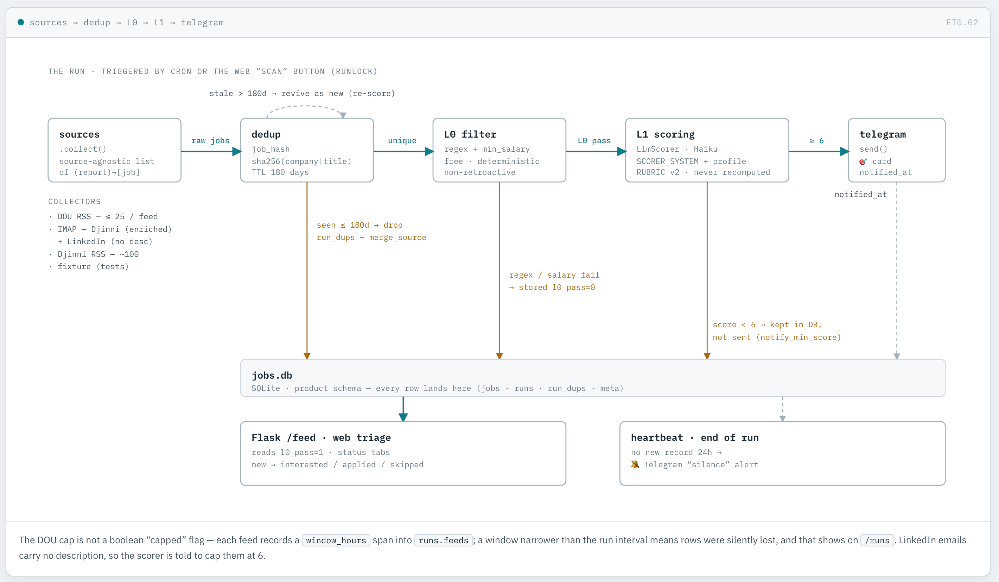
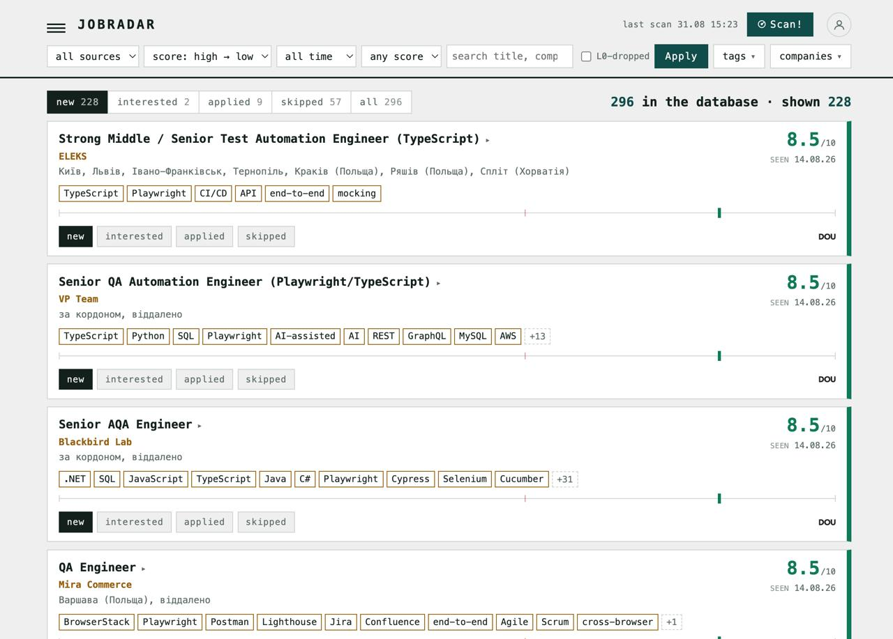
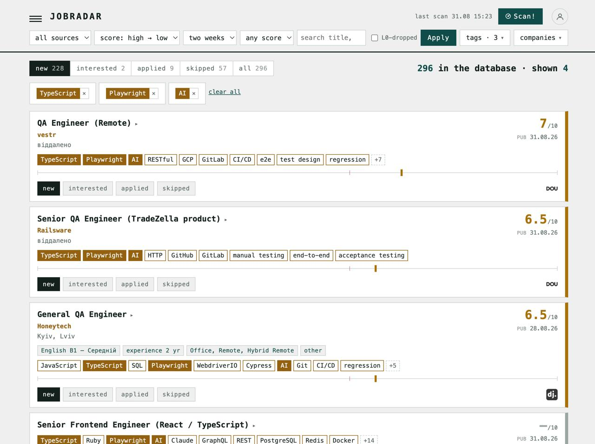
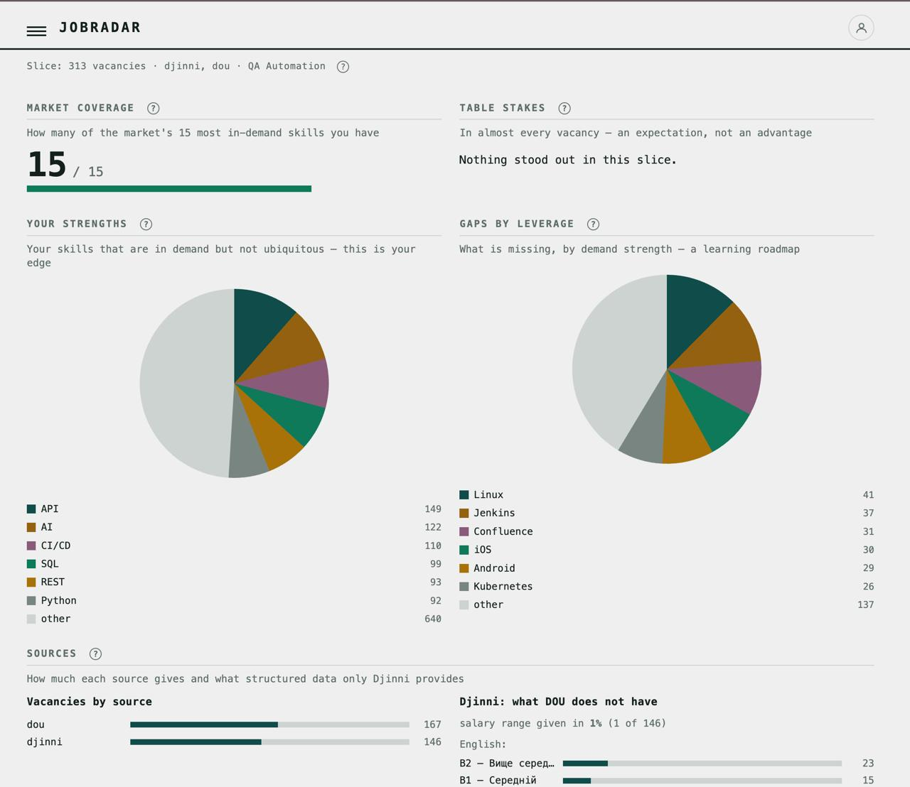
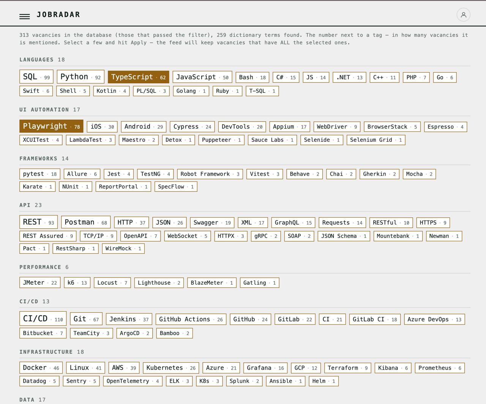
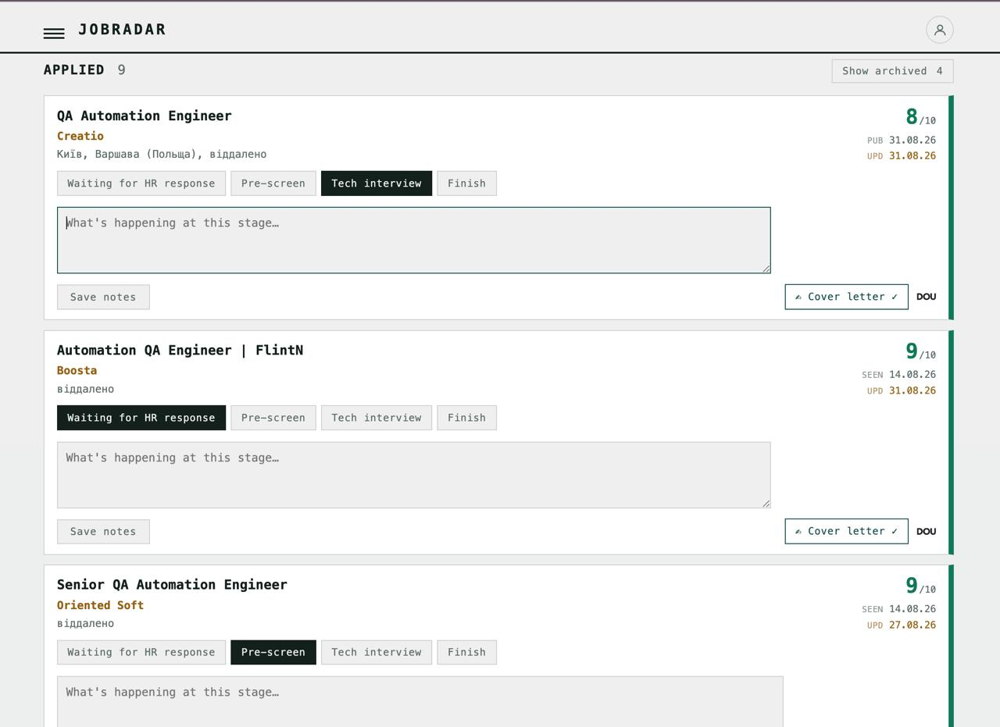

# jobradar

A personal vacancy radar: it collects from DOU RSS and Djinni, deduplicates, filters (L0), scores against the candidate profile via the
Anthropic API, and sends to Telegram whatever is ≥ the threshold; the web UI is
for triaging what's collected.

```
sources → dedup → L0 filter → LLM scoring against the profile → Telegram → web triage
```



## The web UI, screen by screen

The radar collects and scores in the background; the web UI is where you work
through what it found — one screen per route.

**Feed (`/`)** — the main triage surface: scored vacancies as a ranked list, status
tabs (new / interested / applied / skipped) with counts, a shared 0–10 score axis
with a threshold mark so the list reads as a distribution, source / score / text
filters, one-click status changes, a "show L0-dropped" view for tuning the filter,
and per-card cover-letter generation.




**Profile (`/profile`)** — the single source of truth for scoring: paste a CV and the
parser highlights recognised skills; you confirm them, add skills that need not be in
the CV, add a "Stack" of technologies to scan deeper on, and write the "boundaries"
block that keeps the LLM honest.

**Settings (`/settings`)** — everything account- and output-related in one place: the
LLM key / provider / cover-letter model, the Telegram bot (token, chat ID, on/off,
notify threshold, silence alert), and the auto-scan schedule. Stored per-account in
`profile.json` (never committed). Full walkthrough in **§1** below.

**Stats (`/stats`)** — how you fit the market: coverage for the target role, a
skill-gap table, vacancies by source, and a Djinni salary comparison — all computed
live from the collected corpus.



**Tags (`/tags`)** — a clickable cloud of every technology seen across the corpus,
grouped and sized by frequency; click a tag to filter the feed to vacancies that
mention it.



**Hiring pipeline (feed → Applied tab)** — switching the feed to the **applied**
status turns it into the application pipeline: the vacancies you're acting on,
tracked through the hiring stages, with cover-letter generation and archiving of
finished pipelines (behind a "Show archived" toggle).



Also: **Calendar (`/calendar`)** — vacancies laid out by day; **Company
(`/company`)** — vacancies grouped by employer; **Runs (`/runs`)** — the scan
journal with the DOU 25-record cap marker and the heartbeat.

## Design stance

- **Web layer — Flask + Jinja2**: conventional server-rendered HTTP; HTML in
  templates, styles in SCSS (compiled to a static `app.css`), `.py` holds only
  Python. The single runtime dependency is Flask.
- **The collect-and-score core — pure stdlib logic**: HTTP via `urllib`, RSS via
  `xml.etree`, HTML parsing via `html.parser`, DB via `sqlite3`. The web sits on
  the core, not the other way round.
- **Dev layer — professional**: `ruff` (format+lint), `mypy`, `pytest`+`coverage`,
  SCSS via `libsass`, GitHub Actions CI. `make check` = the gate before every PR.

## Architecture

Dependencies flow one way **web → domain → core** (the core never imports the web).
The full stack, layers, and the two flows (web triage; radar run) —
**[docs/architecture.md](docs/architecture.md)**.

```
jobradar/
├── __main__.py           python -m jobradar run|check|top|stats|serve
├── web/                  Flask/Jinja: app.py routes.py views.py forms.py auth.py db.py
│   ├── filters.py format.py urls.py constants.py   Jinja filters/globals, formatters, URLs
│   └── templates/        base.html + one-page-per-route + partials/*macros
├── core/                 the pipeline core (stdlib), split along seams:
│   ├── pipeline.py        the funnel: collect → dedup → L0 → scoring → notify
│   ├── collectors/{dou,djinni,email_alerts}.py + sources.py + http.py   sources (swappable)
│   ├── scoring.py  notify.py           L1 scoring (swappable) and Telegram
│   └── db.py  dedup.py  filters.py  text.py
├── roles.py  skills.py  candidate.py  stats.py   domain (does not import core)
├── runner.py             background run (single-flight + lock)
├── config.py  paths.py  clock.py       config, paths (JOBRADAR_HOME), clock
└── static/app.css        styles, compiled from static/scss/ (make css)
```

Config and data (`config.json`, `jobs.db`, `profile.json`, the log) live in the
project root (or in `JOBRADAR_HOME`). Decisions — in [docs/adr/](docs/adr/).

Also for more information see [detailed artifact](https://claude.ai/code/artifact/5c814055-bc62-41e7-9dcd-b92de56717b0)

## Quick start

```sh
git clone <this-repo> && cd job-radar
make install                       # venv + dev dependencies

cp config.example.json config.json # mailbox + machine settings — see §2 below
cp profile.example.md profile.md   # or build the profile in the web UI

make serve                         # web UI at http://localhost:8787
python -m jobradar run --dry-run   # one full scan, sends nothing
```

Then open the web UI and set up the **Settings page** (LLM key, Telegram bot,
auto-scan) — the one place for all account and output config (**§1**).

The full operational setup — the **Settings page** (LLM, Telegram, auto-scan) and
scheduling — is in **§1** and **§4** below.

## Running the tests

Two independent suites.

### 1. End-to-end — Playwright + TypeScript

```sh
cd jobradar-e2e
python3 -m pip install -r ../requirements.txt   # the product's Flask runtime
npm ci && npx playwright install --with-deps
npm test            # the full Playwright suite (chromium + mobile)
```

### 2. Unit & integration — pytest

```sh
make check          # the full Python gate: ruff + mypy + css-check + pytest
make test           # pytest only
```

Both suites run in CI on every PR ([.github/workflows/](.github/workflows/)):
`e2e.yml` for Playwright, `ci.yml` for the Python gate. See
[jobradar-e2e/README.md](jobradar-e2e/README.md) for the e2e architecture.

## Development

```sh
make install     # venv + dev dependencies (requirements-dev.txt)
make check       # the whole gate: ruff + mypy + css-check + pytest (what CI runs)
make test        # pytest only
make css         # recompile SCSS → static/app.css
make serve       # web UI on localhost:8787
```

**Testability — five seams** (ADR-0007): `JOBRADAR_HOME` isolates data into a
temp directory; `clock.freeze()` freezes time; the scorer and source are
swappable (`pipeline.run(..., scorer=…, http=…, notify=…)`), so collection and
scoring are tested without the network (a JSON fixture source — for e2e seeding).

**Stable e2e selectors**: key UI nodes carry `data-testid` —
`feed`, `job-card` (+`data-hash`), `status-form`/`status-btn` (+`data-status`),
`tag` (+`data-tag`), `calendar-day` (+`data-day`). The e2e suite is a separate
Node/Playwright project `jobradar-e2e/`.

Telegram is the "something worth a look arrived" signal; the web UI is where
triage happens. Both read the same `jobs.db`, so a status set in the browser is
visible in `python -m jobradar top` too.

---

## 1. Settings page — LLM, scoring, Telegram, auto-scan

Everything account- and output-related is on **one screen**: open the web UI, then
**account menu → Settings** (or go to `/settings`). It's stored per-account in
`profile.json` (never committed) and overrides `config.json`. Three blocks:

### LLM access

Powers the two LLM features — vacancy **scoring** and **cover-letter** generation.
(L0 filtering and skill detection are rule-based, so the radar collects and filters
with no key at all.)

- **API key** — your Anthropic (`sk-ant-…`) or OpenAI-compatible key.
- **Provider** — **Anthropic** (default), **OpenAI**, or **Other** (an
  OpenAI-compatible gateway or a local Ollama). The **API base URL** field appears
  **only for _Other_** — Anthropic and plain OpenAI use their own default endpoint.
- **Cover-letter model** — a dropdown (default Claude Sonnet 5). This is *only* the
  cover-letter model; **L1 scoring keeps its own cheaper model** in `config.json`
  (`scorer.model`, Claude Haiku by default — see §2).

Precedence for the key/provider: **Settings → `config.json` (`scorer.*`) → the
`ANTHROPIC_API_KEY` env var**. No key → the pipeline still runs and just sends
everything that passed L0 (handy for the first week, before you pay for scoring).

### Telegram bot

**Create the bot once** (outside the app):

1. In Telegram, message `@BotFather` → `/newbot` → copy the **`bot_token`** (looks
   like `123456789:AA…`).
2. Message your new bot anything — it can't message you until you do.
3. Open `https://api.telegram.org/bot<YOUR_TOKEN>/getUpdates` and copy the number in
   `"chat":{"id":123456789}` — that's your **`chat_id`**.

**Then on the Settings page:**

- **Send matches to Telegram** — the master on/off. Off → scans still score and
  store (visible in the feed), but nothing is pushed.
- **Bot token** / **Chat ID** — paste the two values from above.
- **Notify threshold** — the minimum score that gets pushed to Telegram (default 7;
  tuning it in §8).
- **Silence alert (hours)** — hours with no new vacancy before a "nothing new" ping.
  A broken parser looks exactly like an empty market, so this is the tripwire
  (default 24; §7).

### Auto-scan (in-app schedule)

- **Auto-scan while the app is open** — the running web server triggers a scan on a
  schedule. It fires **only while `serve` is up** (it is not a system service).
- **Every** / **Active from–until** — the interval in hours, gated to an
  active-hours window so there are no night pings. It shares the run lock with the
  Scan button, so scans never overlap. For always-on scheduling instead, use
  cron/launchd — **§4**.

## 2. config.json — what's left in the file

```sh
cp config.example.json config.json
chmod 600 config.json
```

Account and output settings live on the **Settings page** (§1). What stays in
`config.json` is machine-level:

- **`sources.imap.user` / `sources.imap.password`** — the mailbox for Djinni/LinkedIn
  email alerts. Skip if you only use DOU RSS (`sources.imap.enabled: false`).
- **`scorer.enabled` / `scorer.model`** — turn L1 scoring on/off and pick its (cheap)
  model. **The scoring model lives here**, not in Settings; the Settings
  "Cover-letter model" is a separate choice for a different feature.
- **`dedup_ttl_days`**, **`request_delay_seconds`**, **`webui`** (host / port /
  token), **`l0`** (the free pre-LLM filter).

`scorer.api_key` / `scorer.provider` / `scorer.base_url` are **fallbacks only** — the
Settings page overrides them (precedence **Settings → config.json → env**), so leave
them empty once the key is set in the UI. There is no `telegram` section here.

## 3. Check before running

```sh
python3 -m jobradar check            # checks DOU, IMAP, the scorer and Telegram
python3 -m jobradar run --dry-run    # a full run, sends nothing
python3 -m jobradar stats            # what got collected and what got filtered out
python3 -m jobradar top --limit 20   # the best vacancies from the DB
```

`stats` is the main tuning tool. Look at "Top L0 filter reasons": if some rule
filters out 40% — it's too broad.

## 4. Periodic run

A run is `python -m jobradar run` (it needs only the runtime core, not Flask). Put
it on a schedule every ~3 hours. Cron example (08:00–23:00):

```cron
0 8-23/3 * * *  cd /path/to/jobradar && python -m jobradar run >> jobradar.log 2>&1
```

A run holds a lock directory: if the previous one hung on IMAP, the next won't
start and won't spawn duplicates; a lock older than an hour is removed automatically.

> **Legacy:** this used to run on a Synology NAS via the DSM Task Scheduler
> (`run.sh` every 3h). The NAS is off the table ([ADR-0012](docs/adr/0012-flask-jinja-adopt-drop-stdlib-runtime.md));
> any cron / systemd-timer on the host where the project lives will do.

For a no-cron setup, the **Settings page** has an **Auto-scan** toggle (§1): the
running web server triggers scans on the configured cadence, sharing the run lock so
it never overlaps the button. It fires only while `serve` is up — for always-on,
prefer the cron/launchd approach above.

## 5. Web UI

The web layer is on Flask, so install the runtime dependency once:

```sh
pip install -r requirements.txt      # Flask only; the rest of the runtime is stdlib
```

```sh
python3 -m jobradar serve            # address and port come from config.json
python3 -m jobradar serve --port 9000 # a different port for one run
```

It opens at `http://<host-address>:8787/`. What's there:

- **Status tabs** — new / interested / applied / skipped, with counters. A status
  is set in one click, saved to the same database.
- **A shared 0–10 axis** at the top, with a red mark for your threshold. Each row
  puts its own mark on this same scale, so the list reads as a distribution: you
  see how many vacancies are left of the threshold without reading a single number.
- **Filters** — source, minimum score, full-text search.
- **"Show L0-dropped"** — the main tool for tuning the regexes: you see exactly
  what the filter threw out and by which rule.

### Access and security

The database holds your job-search history, so by default the server
**accepts only local connections**. To open it from your phone:

1. Set `webui.token` in `config.json` — any long random string
   (`python3 -c "import secrets; print(secrets.token_urlsafe(24))"`).
2. Open `http://<host-address>:8787/?token=<your token>`.
3. Keep the host behind Tailscale, not a port forwarded in the router. The token
   protects against a stray visit on the home network, but it's not a VPN replacement.

### Keeping serve running

`python3 -m jobradar serve` is a long-lived process; keep it supervised
(a systemd unit, `@reboot` in cron, or `nohup`). The default port is held by one
process, so a second start on the same port simply won't come up.

## 6. How many vacancies you'll see tomorrow

Dedup is permanent, not per-run. A vacancy already seen passes neither L0 nor
scoring nor notification — it doesn't even cost tokens. Out of 58 collected
tomorrow, of which 3 are new, only those of the 3 that passed L0 and scored at
least the threshold reach you. The other 55 stay silent.

`dedup_ttl_days: 180` is the window of this memory. A vacancy last seen more than
180 days ago is treated as reopened: it goes through the full path again and
arrives in Telegram, and the log gets a "Reopened vacancy (last seen ...)" line.
Its status is reset to "new" in the process — even if half a year ago you marked
it "skipped". This is deliberate: over half a year both the vacancy and you change.

## 7. What to do when silence falls

The script catches this itself: if no new vacancy appears within 24 hours, a
"silence for 24h" message arrives. This almost always means one of two things:

- a filter in the mailbox broke and alerts go past the `JobRadar` folder;
- Djinni or LinkedIn changed the email layout.

What to do: `python3 -m jobradar check` → if IMAP is OK but there are no
vacancies, look at the raw email in the mailbox and check whether the link format
changed (`DJINNI_JOB_RE` and `LINKEDIN_JOB_RE` in `core/collectors/email_alerts.py`).

## 8. Tuning the threshold

The **Notify threshold** on the Settings page (§1) is the send cutoff — default 7.
For the first week set it to `6` and watch `python -m jobradar top`: if vacancies at
6.0–6.5 regularly look interesting — lower it, if not — raise it to 7.5. A score
isn't recomputed for already-scored vacancies, so a threshold change affects only
new ones.

If you change the rubric in `SCORER_SYSTEM` or the facts in your profile
(`profile.json`, or its `profile.md` fallback) — change `RUBRIC_VERSION` in
`core/scoring.py`. Otherwise the DB will mix scores from different criteria and
you won't be able to compare them.

## 9. Privacy

`config.json` holds the mailbox password (and the API key only if you use the
config fallback instead of the Settings page); `profile.json` holds the key — and
the Telegram credentials — when set via the UI. `chmod 600 config.json` is mandatory. `jobs.db`, `jobradar.log`
and `webui.log` hold no secrets, but they hold your job-search history — keep the
directory out of shared folders.
