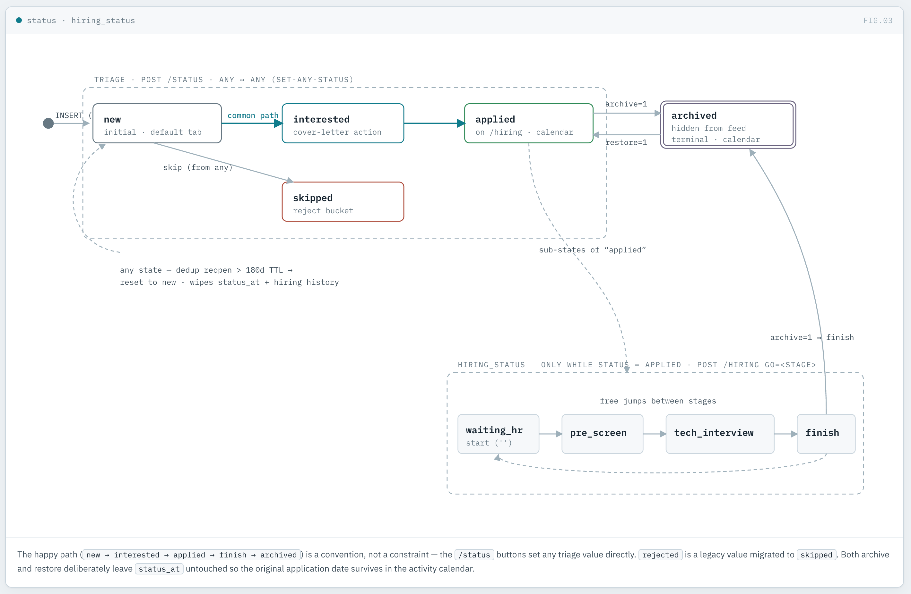

# Архітектура jobradar

Як влаштована система, який стек за що відповідає і як тече запит. Джерело правди
про конкретні рішення — [docs/adr/](adr/); тут — цілісна картина.

```
джерела → дедуп → L0-фільтр → LLM-скоринг проти профілю → Telegram → веб-тріаж
```


## Стек одним поглядом

| Шар | Технологія | Роль |
|---|---|---|
| Веб-фреймворк | **Flask ≥3** (`create_app` factory + Blueprint) | конвенційний server-rendered HTTP ([ADR-0012](adr/0012-flask-jinja-adopt-drop-stdlib-runtime.md)) |
| Шаблони | **Jinja2** (`templates/` + макроси) | HTML у шаблонах, не в `.py` |
| Стилі | **SCSS → `app.css`** (libsass, 12 партіалів) | джерело в `static/scss/`, віддається готовий CSS |
| База | **SQLite** (`sqlite3`, stdlib) | один файл `jobs.db`, без сервера БД |
| Джерела | `urllib` + `xml.etree` + `html.parser` | DOU RSS, Djinni RSS/API, IMAP-листи |
| Скоринг | **Anthropic LLM** через власний HTTP-шар | L1-оцінка проти профілю кандидата |
| Сповіщення | **Telegram Bot API** через `urllib` | нові вакансії в чат |
| CLI | `argparse` (`python -m jobradar …`) | run / check / stats / top / serve |
| Якість | **ruff + mypy + pytest + coverage** | `make check` = CI-гейт |
| E2E | **Playwright** (окремий Node-проєкт `jobradar-e2e/`) | браузерні тести проти `data-testid` |

Рантайм-залежність рівно одна — **Flask** (`requirements.txt`). Решта рантайму —
стандартна бібліотека. Dev-інструменти окремо (`requirements-dev.txt`), у CI.

> Історично рантайм був stdlib-only заради тихої роботи на Synology NAS. Це
> обмеження знято ([ADR-0012](adr/0012-flask-jinja-adopt-drop-stdlib-runtime.md)):
> NAS відпав, проєкт став портфоліо-артефактом, і веб-шар переїхав на
> конвенційний Flask + Jinja2 замість саморобного `http.server` та `el()`-білдера.

## Шарова архітектура

Залежності течуть суворо в один бік: **`web` → домен/підтримка → `core`**. Ядро
ніколи не імпортує веб; CLI-прогін не тягне Flask.

```
jobradar/
├── __main__.py          вхід: `serve` → web, решта → cli
│
├── web/                 ── ПРЕЗЕНТАЦІЯ + HTTP (Flask / Jinja2) ──
│   ├── app.py             create_app() фабрика; серверний main()
│   ├── routes.py          Blueprint: тонкі хендлери GET/POST
│   ├── views.py           data-shaping: SQL + пост-фільтри → context-дікти
│   ├── forms.py           розбір POST-форм (профіль, скан, зміна статусу)
│   ├── auth.py            токен-гейт (порожній токен → лише localhost)
│   ├── db.py              з'єднання БД на запит (flask.g + teardown)
│   ├── filters.py         реєстрація Jinja-фільтрів/глобалів + хелпери картки
│   ├── format.py          форматери значень (дати, скор, humanize-причини)
│   ├── urls.py            будівники URL зі збереженням фільтрів
│   ├── constants.py       мітки статусів/бендів, іконки, popup-JS
│   └── templates/         base.html + сторінка-на-маршрут + partials/*макроси
│
├── (домен + підтримка, top-level) ── СЛОВНИК ПОШУКУ РОБОТИ ──
│   ├── candidate.py       профіль: load / save / parse_cv / scorer_text
│   ├── roles.py           ролі → які фіди / L0 / групи скілів тягне кожна
│   ├── skills.py          словник скілів: tally / canonical / highlight / mentions
│   ├── stats.py           аналіз ринку (покриття, козирі, дірки)
│   ├── runner.py          Runner: single-flight запуск скану + лок
│   ├── config.py          конфіг + логування
│   ├── cli.py             CLI-диспетч (run / check / stats / top)
│   ├── paths.py           JOBRADAR_HOME — усі шляхи через одну точку (seam)
│   └── clock.py           інжектований годинник freeze / now (seam)
│
├── core/                ── КОНВЕЄР ЗБОРУ Й ОЦІНКИ (чиста логіка) ──
│   ├── pipeline.py        воронка run(): збір → дедуп → L0 → скоринг → нотифай
│   ├── collectors/        dou.py · djinni.py · email_alerts.py (парсери джерел)
│   ├── sources.py         абстракція джерела (підмінна — seam)
│   ├── http.py            HTTP-шар з інжектованим post/get (seam)
│   ├── dedup.py           normalize_key + job_hash (ключ дедупу)
│   ├── filters.py         L0-фільтр (регулярки + вилка, безкоштовно)
│   ├── scoring.py         LLM-скорер (Null / Anthropic — підмінний seam)
│   ├── notify.py          формування Telegram-повідомлення
│   ├── db.py              схема, міграції, db_connect, журнал прогонів
│   └── text.py            sanitize_html, parse_feed_date
│
└── static/app.css       скомпільований зі static/scss/ (make css)
```

Розкладка ядра по швах — [ADR-0009](adr/0009-core-decomposition-and-swappable-seams.md);
пакетна структура й `python -m jobradar` — [ADR-0006](adr/0006-package-layout-and-python-m-entry.md).

## Хто за що відповідає — два потоки

### Потік 1 — веб-тріаж (людина відкриває сторінку)

```
браузер → routes.py (auth → get_db) → views.py (SQL + пост-фільтр → context)
        → render_template(...) → Jinja (filters / urls / constants + макроси) → HTML
```

Маршрут лишається тонким: авторизує, відкриває з'єднання, делегує збір даних у
`views`, віддає шаблон. Уся логіка «що показати» — у `web/views.py`; уся
розмітка — у `templates/`; форматери й будівники URL зареєстровані як Jinja
фільтри/глобали (`web/filters.py`). Стан HTTP не тече в рендер.

Тріаж — це зміна статусу вакансії (`POST /status` ставить будь-який), а для
статусу «applied» додається під-машина `hiring_status`. Модель переходів:



### Потік 2 — прогін радара (кнопка Scan! або cron)

```
runner.Runner.trigger()            single-flight: лок не дає двом прогонам збігтися
  └─ core.pipeline.run():
       collectors (DOU / Djinni / email)      →  дедуп (sha256(company|title), TTL 180д)
       →  L0-фільтр (регулярки, дешево)        →  LLM-скоринг (лише те, що пройшло L0)
       →  запис у SQLite + журнал прогону      →  Telegram-нотифай
```

Кожен крок — окремий модуль `core/`; воронка зводиться в `pipeline.run()`, а
сторінка `/runs` показує її арифметику (стягнуто = дублі + відсів + нових).
Двоярусність (дешевий L0 перед платним L1) — свідома економіка.

## Наскрізні рішення (testability seams)

Роблять систему тестованою й гнучкою без монкіпатчингу
([ADR-0007](adr/0007-testability-seams-home-and-clock.md), [ADR-0009](adr/0009-core-decomposition-and-swappable-seams.md)):

- **`paths.JOBRADAR_HOME`** — усі змінні дані (config, БД, профіль, лог) через одну
  функцію; тест / e2e задає інший HOME і повністю ізольований.
- **`clock`** — інжектований час (`freeze` / `now`); тести не залежать від «зараз».
- **Підмінні скорер і джерело** — `scoring` (Null / Anthropic) та `sources` / `http`
  приймають залежності ззовні; тести підставляють фейки, збір і оцінка йдуть без мережі.
- **`data-testid`** на ключових вузлах — стабільні селектори для Playwright
  (`feed`, `job-card`, `status-form` / `status-btn`, `tag`, `calendar-day`); пережили
  міграцію el() → Jinja.
- **Односторонній граф залежностей** — `core` / домен не знають про Flask.

## Тестування

`make check` = CI-гейт: **ruff** (формат + лінт) + **mypy** + **css-check** (app.css
відповідає SCSS) + **pytest**. Веб-шар тестується чорноскринькою через Flask
`test_client` (`tests/test_web.py`); домен — юніт-тестами; e2e — окремий
Playwright-проєкт `jobradar-e2e/` проти `data-testid`.

---

Одним реченням: **Flask + Jinja2 фронт над чистим ядром збору-й-оцінки, з SQLite
як стан і LLM лише на другому ярусі фільтрації** — веб малює, домен знає словник
пошуку роботи, ядро збирає й оцінює.
