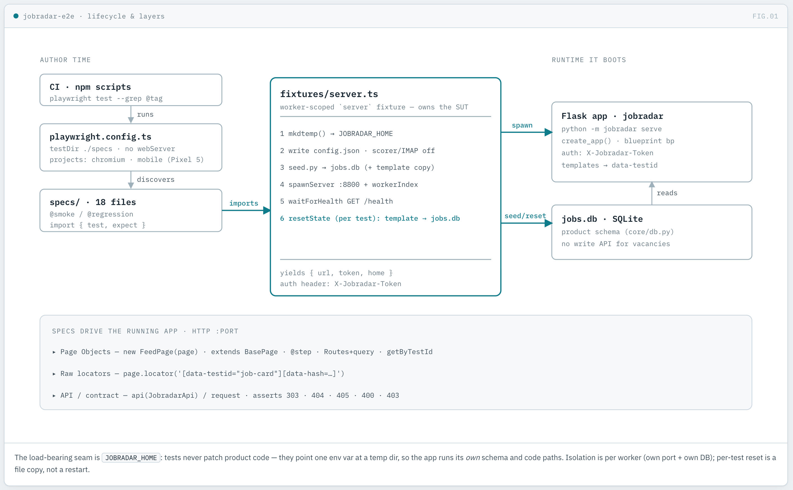

# jobradar-e2e — architecture

How the suite is put together, and why. The one idea to take away: the framework
is assembled **bottom-up, and each layer enables the next**. It is a chain of
dependencies rooted in per-worker isolation, not a flat pile of tests.

## The core idea

Playwright folds the transport layer, the request factory and the option builders
into the runner. Two layers remain mine: the **page object model** and the **test
data**. On top of them sits the one decision everything else depends on —
**isolation is per worker**: each worker gets its own server, database and port,
keyed by the `JOBRADAR_HOME` environment variable the product already honours.
Real isolation, not unique-name suffixes.

## The dependency chain

```
harness (bring up the SUT)
   └─▶ per-worker isolation (own server + DB + port, via JOBRADAR_HOME)
          └─▶ seed (deterministic data in that DB)
                 └─▶ API facade (prepare state and hit the contract fast)
                        └─▶ POM (UI flows on stable locators)
                               └─▶ multi-project config (desktop / mobile / deployed)
                                      └─▶ tags + grep (select the slice)
                                             └─▶ reporting (list / html / junit)
                                                    └─▶ CI (matrix + shard + merge)
                                                           └─▶ @step decorator
```

## Lifecycle & layers

The suite runs bottom-up: author-time config discovers the specs, a worker-scoped
fixture boots an isolated app per worker, and the specs drive that running app over
HTTP. Isolation-per-worker does not limit parallelism — it is what *enables* it:
each worker runs in its own process with its own server, port and database, so
nothing is shared and nothing races.



Why teardown lives in the fixture and not in an `afterEach`: it is scoped to the
worker's lifetime (one server boot amortised across all its tests) and it still
runs when a test throws.

## Layer by layer

Each layer switches on the one below it. Everything here is implemented and green.

### 1. Harness — bring up the SUT
The worker fixture boots the app itself (`python -m jobradar serve --port N`,
then waits on `/health`) and kills it afterwards. No manual step, no secrets:
a test starts only once `/health` answers.

### 2. Worker-scoped isolation — the centre of everything
A per-**worker** fixture creates a temp directory, writes its own `config.json`
(own token, scorer and IMAP disabled) and its own `jobs.db`, and boots a server
on its own port; after the worker it kills the process and removes the directory.
The mechanism is the **`JOBRADAR_HOME`** env var, through which the product takes
every data path — so the product code is never patched for tests. This one seam
enables three things at once:
- **true parallelism** — workers never contend over a shared DB;
- **authorization tests** — each worker has its own known token (403, header auth);
- **destructive tests** — a status change can run safely, because the DB is the
  worker's own and disposable.

### 3. Seed — deterministic data
A helper creates the schema (`db_connect`) and inserts a known set of vacancies
(fixed tags, companies, statuses). Feed, tags, company page and status flow are
then asserted against a known state rather than "whatever is there today". A
pristine copy is kept and restored before each test.

### 4. API facade — `api/` over `APIRequestContext`
A thin class centralising `baseURL`, the token header (`X-Jobradar-Token`) and
routes. It hits the HTTP contract fast (codes, redirects, validation) and
prepares state through the API instead of the slow UI; API and UI layers are
split explicitly.

### 5. POM — page object model
Page classes (feed, tags, calendar, company, profile) over a base class; locators
are by **`data-testid`** (`job-card`, `status-btn`, `tag`, `calendar-day`) and by
role/name, not by CSS. UI flows run against stable locators, so a re-style does
not break tests. Web-first assertions auto-wait, removing a class of flakiness.

### 6. Multi-project config — desktop / mobile / deployed
`projects` in the config: `chromium` (fixture boots the server), `mobile`
(Pixel 5 viewport, same suite), and a planned `deployed` project that reads
`JOBRADAR_URL` from env and `grep`s down to `@smoke-readonly`. The same suite runs
across environments and devices **without touching test code**.

### 7. Tags + grep + scripts
`@smoke` / `@regression` (and `@smoke-readonly` for the deployed project) plus
`--grep`. Selection is by meaning — a fast smoke on a PR, the full regression on
merge — not by editing path-based ignore lists.

### 8. Reporting — list / html / junit
`list` (live console) + `html` (triage) + `junit` (for CI). On shards, `blob` +
`npx playwright merge-reports` fold the pieces into a single report.

### 9. CI — GitHub Actions
`retries` and `workers` live in the config, branched on `process.env.CI`; the
workflow only triggers the run. Sharding (`--shard=i/N`) with a merge job is the
scale-out path.

### 10. `@step` decorator
A TypeScript method decorator ([utils/step.ts](utils/step.ts)) wrapping POM
methods in `test.step`, so each POM call is a named step in the trace — a direct
analog of an Allure `@step`.

## Summary

The framework's spine is **per-worker isolation**: it is the root from which
parallelism, safe destructive tests and horizontal scale all grow. Everything
above it — seed, API facade, POM, config, tags, reporting, CI — is the machinery
that serves and scales that isolation.
